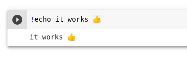

<h1 align="center">How to run this? 🤔</h1>

<h2>1. You can copy this code and put into a /<a href="https://jupyter.org/">jupyter notebook</a>/<a href="https://jupyter.org/">jupyter lab</a> notebook and run to test.</h2>

    

<h2>2. Or you can download files, open and run by yourself</h2>
